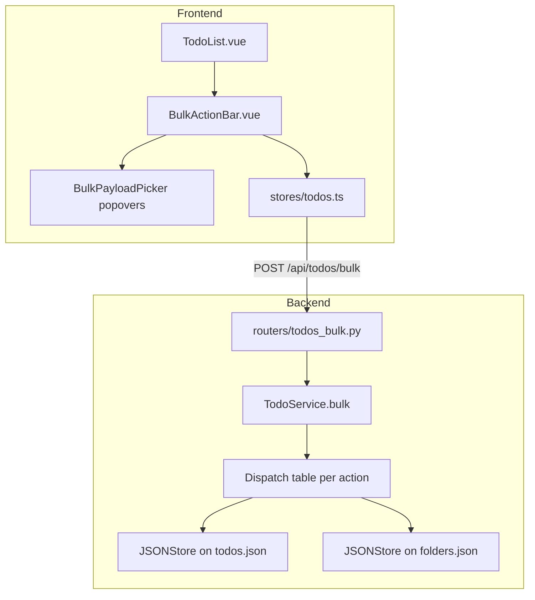

# Design Document: Bulk Actions

## Overview

Adds a single bulk endpoint that applies one action across many todos in one atomic write, returning a per-id outcome map. The frontend gains a select mode, a floating action bar, and optimistic updates with reconciliation against server outcomes.

Key design decisions:

- **One endpoint, action enum, optional payload.** A single `/api/todos/bulk` keeps the surface small. Actions are an enum so the action set is explicit and easy to test. A typed `payload` discriminator means each action validates only what it needs.
- **One read, one write.** The backend reads `todos.json` once, computes all changes in memory, then writes once. This matches the JSONStore atomicity model and keeps the bulk operation O(N) over the file rather than O(N) in disk writes.
- **Per-id outcomes, not per-id failures.** A 200 OK with an outcomes map handles partials cleanly. Request-level problems (malformed body, oversize batch, unknown action) still 4xx.
- **`not_found` rather than `forbidden` for cross-user ids.** Matches the existing leak-prevention pattern in the app.
- **Spawn-once per series for `mark_done`.** When a bulk done includes multiple occurrences of the same recurring series, only one next occurrence is spawned (the highest `recurrence_index` in the batch). Prevents accidentally fast-forwarding a series.
- **No optimistic delete.** Removing a row optimistically and snapping it back on failure is jarring; we delete only after server confirmation. Other actions are optimistic.

## Architecture



### Bulk request flow

```mermaid
sequenceDiagram
    participant FE as Frontend
    participant R as POST /api/todos/bulk
    participant TS as TodoService.bulk
    participant TR as todos.json
    participant FR as folders.json (only for move_to_folder)

    FE->>R: { ids:[..], action, payload }
    R->>TS: bulk(user, dto)
    TS->>TS: validate request shape, action, payload, batch size
    alt invalid request
        TS-->>R: raise ValidationError or PayloadTooLargeError
    end
    opt move_to_folder with non-null folder_id
        TS->>FR: read all folders, verify ownership
        alt invalid folder
            TS-->>R: raise ValidationError
        end
    end
    TS->>TR: read_all
    TS->>TS: dedupe ids, classify each (owned/not-found/invalid)
    TS->>TS: apply action in memory; track outcomes
    opt mark_done with recurring members
        TS->>TS: pick max recurrence_index per series; build next occurrences
    end
    TS->>TR: write_all (one atomic write)
    TS-->>R: { outcomes, summary }
    R-->>FE: 200 OK
    FE->>FE: reconcile optimistic state, refresh, toast summary
```

## Components and Interfaces

### Backend

#### 1. Request and response DTOs (`models.py` additions)

```python
from typing import Literal, Annotated
from pydantic import BaseModel, Field, model_validator

class BulkActionPayloadMove(BaseModel):
    folder_id: str | None = None    # null = clear

class BulkActionPayloadTag(BaseModel):
    tag: str = Field(min_length=1, max_length=40)

class BulkActionPayloadPriority(BaseModel):
    priority: Priority

class BulkActionRequest(BaseModel):
    ids: list[str] = Field(min_length=1, max_length=200)
    action: Literal[
        "mark_done", "mark_pending", "mark_in_progress",
        "delete",
        "move_to_folder",
        "add_tag", "remove_tag",
        "set_priority",
    ]
    payload: dict | None = None     # action-specific; validated in service

class BulkOutcomeStatus(str, Enum):
    SUCCEEDED = "succeeded"
    NOT_FOUND = "not_found"
    FORBIDDEN = "forbidden"             # reserved for future RBAC
    VALIDATION_ERROR = "validation_error"
    NO_CHANGE = "no_change"

class BulkOutcome(BaseModel):
    status: BulkOutcomeStatus
    error: str | None = None

class BulkSummary(BaseModel):
    total: int
    succeeded: int
    not_found: int
    forbidden: int
    validation_error: int
    no_change: int

class BulkActionResponse(BaseModel):
    outcomes: dict[str, BulkOutcome]
    summary: BulkSummary
```

#### 2. `services/todo_service.py` additions

```python
class TodoService:
    # ... existing methods ...

    def bulk(self, user_id: str, dto: BulkActionRequest) -> BulkActionResponse:
        """Apply dto.action across dto.ids for one user, returning per-id outcomes."""
        # 1. Validate payload shape for the chosen action.
        # 2. Optionally pre-validate move_to_folder target folder.
        # 3. Read all todos.
        # 4. Dedupe ids (preserve first-occurrence order).
        # 5. Classify each id: invalid syntax / not_found (or not owned) / owned.
        # 6. Apply action in memory; collect outcomes; track touched.
        # 7. For mark_done with recurring members: spawn next occurrence per series at max index.
        # 8. Single write_all if any change; otherwise skip write.
        # 9. Return outcomes + summary.

    def _validate_bulk_payload(self, action, raw_payload) -> object:
        """Returns a typed payload model or raises ValidationError."""

    def _id_is_uuid_like(self, s: str) -> bool:
        """Loose check; rejects empty/whitespace, requires hyphenated 8-4-4-4-12 hex pattern."""
```

Action dispatch (table-driven inside `bulk`):

```python
ACTION_HANDLERS = {
    "mark_done":         lambda t: _set_status(t, Status.DONE),
    "mark_pending":      lambda t: _set_status(t, Status.PENDING),
    "mark_in_progress":  lambda t: _set_status(t, Status.IN_PROGRESS),
    "delete":            lambda t: ("delete", None),                # marker
    "move_to_folder":    lambda t, p: _set_folder(t, p.folder_id),
    "add_tag":           lambda t, p: _add_tag(t, p.tag),
    "remove_tag":        lambda t, p: _remove_tag(t, p.tag),
    "set_priority":      lambda t, p: _set_priority(t, p.priority),
}
```

Each handler returns one of:
- `("changed", new_todo)` — updates `updated_at` and applies change
- `("no_change", original_todo)` — outcome `no_change`
- `("delete", None)` — todo is removed from the in-memory list

Tag normalization helper:

```python
def normalize_tag(tag: str) -> str:
    t = tag.strip().lower()
    if not t:
        raise ValidationError("tag must be non-empty after trimming")
    return t
```

#### 3. Recurring spawn handling

Within `bulk` for action `mark_done`:

```python
# Group owned, status-transitioning recurring todos by series id; pick max index per series.
to_spawn: dict[str, Todo] = {}
for tid in candidate_for_done:
    todo = ...  # the in-memory mutated todo (status=DONE)
    if todo.recurrence != Recurrence.NONE and todo.recurrence_series_id is not None:
        prev = to_spawn.get(todo.recurrence_series_id)
        if prev is None or todo.recurrence_index > prev.recurrence_index:
            to_spawn[todo.recurrence_series_id] = todo

for series_id, base in to_spawn.items():
    if recurrence_helper.should_spawn_next(base):
        new_occ = recurrence_helper.build_next_occurrence(base, datetime.now(tz=UTC))
        all_todos.append(new_occ)
```

This guarantees one spawn per series even if the user marks 5 occurrences done at once.

#### 4. `routers/todos_bulk.py` (or extend `routers/todos.py`)

```python
@router.post("/bulk", response_model=BulkActionResponse)
async def bulk_action(
    dto: BulkActionRequest,
    current_user: User = Depends(get_current_user),
):
    return todo_service.bulk(current_user.id, dto)
```

Route lives at `POST /api/todos/bulk`. Status `200` on success (including partials); the existing exception handlers map ValidationError -> 422 and PayloadTooLargeError -> 413.

A small `PayloadTooLargeError` is added to `exceptions.py` if not already present:

```python
class PayloadTooLargeError(Exception): ...

@app.exception_handler(PayloadTooLargeError)
async def handle_too_large(_, exc):
    return JSONResponse(status_code=413, content={"detail": str(exc) or "Payload too large"})
```

### Frontend

#### 1. `types/index.ts` additions

```typescript
type BulkAction =
  | 'mark_done' | 'mark_pending' | 'mark_in_progress'
  | 'delete'
  | 'move_to_folder'
  | 'add_tag' | 'remove_tag'
  | 'set_priority'

type BulkOutcomeStatus =
  | 'succeeded' | 'not_found' | 'forbidden' | 'validation_error' | 'no_change'

interface BulkOutcome { status: BulkOutcomeStatus; error?: string }

interface BulkSummary {
  total: number
  succeeded: number
  not_found: number
  forbidden: number
  validation_error: number
  no_change: number
}

interface BulkResponse {
  outcomes: Record<string, BulkOutcome>
  summary: BulkSummary
}
```

#### 2. `stores/todos.ts` additions

```typescript
state: () => ({
  // ... existing ...
  selectedIds: new Set<string>(),
  selectMode: false,
}),

actions: {
  toggleSelectMode() { this.selectMode = !this.selectMode; if (!this.selectMode) this.selectedIds.clear() },
  toggle(id: string) { this.selectedIds.has(id) ? this.selectedIds.delete(id) : this.selectedIds.add(id) },
  selectAllVisible(ids: string[]) { ids.forEach(i => this.selectedIds.add(i)) },
  clearSelection() { this.selectedIds.clear() },

  async runBulk(action: BulkAction, payload?: object) {
    const ids = Array.from(this.selectedIds)
    const optimisticPatch = action === 'delete' ? null : this._buildOptimisticPatch(action, payload)
    if (optimisticPatch) this._applyOptimistic(ids, optimisticPatch)

    let res: BulkResponse
    try {
      res = await api.post('/todos/bulk', { ids, action, payload })
    } catch (e) {
      if (optimisticPatch) this._revertOptimistic(ids, optimisticPatch)
      toast.error('Bulk action failed')
      throw e
    }

    // Reconcile: revert ids with non-success outcomes
    if (optimisticPatch) {
      const failedIds = Object.entries(res.outcomes)
        .filter(([, o]) => o.status !== 'succeeded' && o.status !== 'no_change')
        .map(([id]) => id)
      this._revertOptimistic(failedIds, optimisticPatch)
    }

    if (action === 'delete') {
      const removed = Object.entries(res.outcomes)
        .filter(([, o]) => o.status === 'succeeded')
        .map(([id]) => id)
      this.todos = this.todos.filter(t => !removed.includes(t.id))
    }

    await this.fetchTodos()  // for spawned occurrences and to recover stats
    toast.info(formatSummary(res.summary))
    this.clearSelection()
  },
}
```

#### 3. Components

- `components/BulkActionBar.vue`: floating bar, fixed bottom, shown when `selectMode && selectedIds.size > 0`. Shows count, buttons for each action; opens popovers for actions that need payload.
- `components/BulkPayloadPicker.vue`: small popover with action-specific input (folder dropdown, tag input, priority radio).
- Modifications:
  - `TodoList.vue`: render checkboxes when `selectMode`. Header has "select all visible" + "exit select mode".
  - `TodoItem.vue`: checkbox is the leftmost element in select mode; existing controls remain.
  - Dashboard header: a "Select" toggle button to enter select mode.

#### 4. Confirmation behavior

- Delete via bulk uses the existing `ConfirmDialog` with the count interpolated: "Delete 12 todos? This cannot be undone."

## Data Models

No new persistent files; all operations modify `todos.json`.

## Correctness Properties

### Property 1: Bulk leaves the store consistent under partial failures

*For any* bulk request, after the call: every owned id with outcome `succeeded` SHALL reflect the action in `todos.json`; every id with outcome `not_found` SHALL not have changed any record (its id was never owned by the user); every id with outcome `validation_error` SHALL not have changed any record; every id with outcome `no_change` SHALL be unchanged in the store. No cross-user todo SHALL be modified.

**Validates: Requirements 1.1, 3.1, 3.2, 3.3, 3.4, 3.5, 11.1**

### Property 2: Single atomic write

*For any* bulk request that touches at least one record, exactly one `JSONStore.write_all` SHALL be invoked for `todos.json`. *For any* bulk request that touches zero records (e.g., all `not_found` or all `no_change`), zero writes SHALL be invoked.

**Validates: Requirements 4.1, 4.3**

### Property 3: Dedup preserves first-occurrence order

*For any* `ids` containing duplicates, the resulting `outcomes` map SHALL contain each unique id exactly once, and iteration order over `outcomes` SHALL match the first-occurrence order of each id in `ids`.

**Validates: Requirements 1.4, 1.8**

### Property 4: Batch size enforcement

*For any* bulk request with `len(ids) > MAX_BULK_IDS`, the response SHALL be 413 and `todos.json` SHALL NOT be modified.

**Validates: Requirements 1.7, 4.2**

### Property 5: Action enum enforcement

*For any* bulk request whose `action` is not in the enumerated set, the response SHALL be 422 and `todos.json` SHALL NOT be modified.

**Validates: Requirements 2.2**

### Property 6: Payload validation pre-empts processing

*For any* bulk request whose `payload` does not match the chosen `action` shape (missing `folder_id` is acceptable for `move_to_folder` to mean "clear"; missing `tag` for tag actions is invalid; missing `priority` for `set_priority` is invalid; bad enum values are invalid), the response SHALL be 422 and `todos.json` SHALL NOT be modified.

**Validates: Requirements 2.9**

### Property 7: User isolation

*For any* user A sending a bulk request whose `ids` include a todo owned by user B, the outcome for that id SHALL be `not_found` and the todo SHALL NOT be modified.

**Validates: Requirements 3.2, 11.1**

### Property 8: Tag set semantics

*For any* `add_tag` action, after the call, every owned target todo's `tags` SHALL contain the normalized tag exactly once (no duplicates introduced). *For any* `remove_tag` action, after the call, no owned target todo's `tags` SHALL contain the normalized tag.

**Validates: Requirements 2.6, 2.7, 6.1, 6.3**

### Property 9: Tag normalization

*For any* `tag` payload value, the persisted tag SHALL equal `tag.strip().lower()`. *For any* tag whose normalized form is empty, the response SHALL be 422.

**Validates: Requirements 6.1, 6.2_

### Property 10: One spawn per series for bulk mark_done

*For any* bulk `mark_done` request that includes K occurrences from the same recurring series with `should_spawn_next == True`, after the call exactly one new occurrence SHALL be added to `todos.json` for that series, with `recurrence_index = max(included_indices) + 1`.

**Validates: Requirements 7.1, 7.2**

### Property 11: Folder validation pre-empts processing

*For any* `move_to_folder` request whose `folder_id` is non-null and references a folder that does not exist or is not owned by the authenticated user, the response SHALL be 422 and `todos.json` SHALL NOT be modified.

**Validates: Requirements 5.1**

### Property 12: Round-trip after bulk

*For any* set of todos modified by a bulk action, serializing each modified Todo to JSON and deserializing back SHALL produce equivalent Todo objects.

**Validates: Requirements 11.2**

### Property 13: No-change is idempotent

*For any* bulk action repeated twice in succession on the same selection, the second response SHALL contain only `no_change` outcomes for ids unchanged by the first call (e.g., same tag added twice; same status set twice), and `todos.json` SHALL NOT be modified by the second call (zero writes per Property 2).

**Validates: Requirements 3.4, 4.3**

## Error Handling

| Error | Status | Where | Message |
|-------|--------|-------|---------|
| Missing/invalid `ids` | 422 | Pydantic | field-level error on `ids` |
| Empty `ids` | 422 | Pydantic | `[{"field":"ids","message":"At least one id required"}]` |
| `len(ids) > 200` | 413 | Pydantic | `[{"field":"ids","message":"Maximum 200 ids per request"}]` |
| Unknown `action` | 422 | Pydantic Literal | field-level on `action` |
| Bad `payload` for action | 422 | TodoService._validate_bulk_payload | field-level on `payload.<field>` |
| Folder unowned | 422 | TodoService.bulk | `[{"field":"folder_id","message":"Folder not found"}]` |
| File I/O failure | 500 | JSONStore | `{"detail":"Internal server error"}` |

Per-id outcomes are conveyed in the response body, not as HTTP errors.

## Testing Strategy

### Backend

**Unit / example-based**:
- Each action with a single id (happy path).
- `not_found` for cross-user ids.
- `no_change` for repeated `add_tag`, repeated `mark_done`.
- `validation_error` for malformed UUIDs in `ids`.
- Folder-validation failure aborts before any write.
- 200 ids upper bound; 201 ids returns 413.
- `mark_done` on a recurring series with 3 occurrences (indices 0, 1, 2) all in the batch: exactly one new occurrence created with `recurrence_index = 3`.

**Property-based** (Hypothesis, `@settings(max_examples=100)`):
- Properties 1-13 above. Tagged `Feature: bulk-actions, Property {N}: {title}`.

**Strategies**:
```python
ids_with_duplicates_strategy()        # lists with controlled duplicate density
mixed_owned_unowned_ids_strategy()    # mixes target user's ids with other users' ids
bulk_action_strategy()                # picks action and a matching valid payload
```

### Frontend

- `BulkActionBar.vue`: visibility binding to `selectMode && size > 0`; button click invokes `runBulk` with correct args.
- `stores/todos.ts.runBulk`:
  - Optimistic apply for non-delete actions; revert on partial failures based on outcomes.
  - Delete branch removes only succeeded ids.
  - Network error reverts optimistic state and shows toast.
- Selection: select all visible respects current filter; exit select mode clears selection.

### Test layout additions

```
backend/tests/
  test_todo_service_bulk.py
  test_todo_router_bulk.py

frontend/tests/components/
  BulkActionBar.spec.ts
  BulkPayloadPicker.spec.ts

frontend/tests/stores/
  todos.bulk.spec.ts
```
