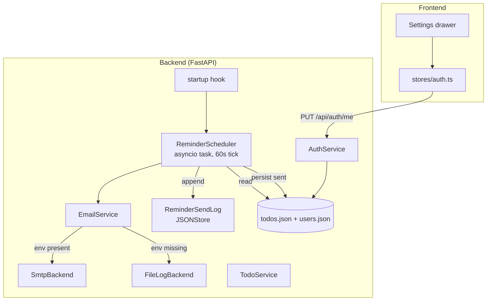

# Design Document: Email Reminders

## Overview

A backend scheduler dispatches email reminders for todos when their `reminder_at` time arrives. The dispatcher is a long-running asyncio task launched on FastAPI startup; it polls every 60 seconds for due reminders, sends emails through a pluggable backend (SMTP or local file-log fallback), and persists per-todo "sent" state plus an append-only attempt log. Per-user opt-out and a global rate cap protect against runaway delivery.

Key design decisions:

- **Poll, not cron, not external worker.** A single in-process asyncio task keeps the architecture aligned with the rest of the app (no Redis, no Celery). 60 s granularity is sufficient for a personal todo app and matches the perceived "soon" semantics of reminders.
- **Persist `reminder_sent` per-todo** rather than tracking sent state in a separate table. One field on Todo is enough; the existing `JSONStore` atomic write guarantees idempotency.
- **Reset on `reminder_at` change.** Editing a reminder time clears `reminder_sent` so the new time fires. Clearing the reminder also clears `reminder_sent` so toggling on later behaves naturally.
- **Pluggable backends with auto-detection.** SMTP is used when env vars are present; otherwise the file-log backend appends to `data/email_log.jsonl`. This keeps local dev frictionless and gives ops a clear failure mode.
- **Retries on a per-reminder task, not blocking the cycle.** A failure with backoff (5 s, 25 s) runs in its own asyncio task so a slow SMTP doesn't delay other due reminders.
- **Rate limit is global, not per-user.** Protects the SMTP relay from a backlog (e.g., scheduler resumes after long downtime). Simpler than per-user fairness; sufficient for current scale.
- **Crash safety: persist before retry.** `reminder_sent = true` is set only after the send succeeds (or after exhausting retries). A crash between dispatch and persist re-dispatches the reminder on next startup. The duplicate window is bounded to a single in-flight reminder.

## Architecture



### Polling cycle

```mermaid
sequenceDiagram
    participant T as 60s tick
    participant Sched as ReminderScheduler
    participant TS as TodoService
    participant US as user lookup
    participant ES as EmailService
    participant Log as ReminderSendLog
    participant DB as todos.json

    T->>Sched: tick
    Sched->>DB: read all todos
    Sched->>Sched: filter due AND not sent
    Sched->>Sched: enforce rate cap (defer overflow)
    loop per due reminder (in parallel, up to N)
        Sched->>US: load user
        alt user missing
            Sched->>Log: skipped_user_missing
            Sched->>DB: set reminder_sent=true
        else opt-out
            Sched->>Log: skipped_optout
            Sched->>DB: set reminder_sent=true, reminder_sent_at=now
        else
            Sched->>ES: send(email, subject, text, html) [attempt 1]
            alt success
                Sched->>DB: set reminder_sent=true, reminder_sent_at=now
                Sched->>Log: sent (attempt 1)
            else fail -> retry 5s
                Sched->>ES: send [attempt 2]
                alt success
                    Sched->>DB: persist; Log sent (attempt 2)
                else fail -> retry 25s -> attempt 3
                    Sched->>ES: send [attempt 3]
                    alt success
                        Sched->>DB: persist; Log sent (attempt 3)
                    else final fail
                        Sched->>DB: set reminder_sent=true, reminder_sent_at=now
                        Sched->>Log: failed (3, error)
                    end
                end
            end
        end
    end
```

## Components and Interfaces

### Backend

#### 1. `models.py` additions

```python
class Todo(BaseModel):
    # ... existing fields ...
    reminder_sent: bool = False
    reminder_sent_at: datetime | None = None

class User(BaseModel):
    # ... existing fields ...
    email_reminders_enabled: bool = True

class UserResponse(BaseModel):
    id: str
    email: str
    username: str
    created_at: datetime
    email_reminders_enabled: bool

class UserPreferencesUpdate(BaseModel):
    email_reminders_enabled: bool
```

#### 2. `services/email_service.py`

```python
class EmailBackend(Protocol):
    async def send(self, *, to: str, subject: str, text: str, html: str) -> None: ...

class SmtpBackend:
    def __init__(self, host, port, user, password, sender, use_tls="ssl"): ...
    async def send(self, *, to, subject, text, html) -> None:
        # Wraps blocking smtplib in asyncio.to_thread
        ...

class FileLogBackend:
    def __init__(self, path: Path): ...
    async def send(self, *, to, subject, text, html) -> None:
        # Append one JSON line to path; never raise
        ...

class EmailService:
    def __init__(self, backend: EmailBackend, frontend_url: str): ...

    async def send_reminder(self, *, user_email: str, todo: Todo) -> None:
        subject, text, html = self._render(todo)
        await self.backend.send(to=user_email, subject=subject, text=text, html=html)

    @staticmethod
    def _render(todo: Todo) -> tuple[str, str, str]:
        """Build subject, plain-text, and HTML bodies. HTML-escapes user text."""
        ...

def build_email_service(env: Mapping[str, str]) -> EmailService:
    """Auto-select backend based on env vars."""
    required = ["SMTP_HOST", "SMTP_PORT", "SMTP_USER", "SMTP_PASS", "SMTP_FROM"]
    if all(env.get(k) for k in required):
        backend = SmtpBackend(
            host=env["SMTP_HOST"],
            port=int(env["SMTP_PORT"]),
            user=env["SMTP_USER"],
            password=env["SMTP_PASS"],
            sender=env["SMTP_FROM"],
            use_tls=env.get("SMTP_USE_TLS", "ssl"),
        )
        log.info("EmailService backend=smtp host=%s", _mask(env["SMTP_HOST"]))
    else:
        backend = FileLogBackend(Path("data/email_log.jsonl"))
        log.info("EmailService backend=file-log path=data/email_log.jsonl")
    return EmailService(backend=backend, frontend_url=env.get("FRONTEND_URL", "http://localhost:3000"))
```

#### 3. `services/reminder_scheduler.py`

```python
class ReminderScheduler:
    POLL_INTERVAL_SECONDS = 60
    BACKOFFS = [5, 25]            # attempts: 1 immediate, 2 after 5s, 3 after 25s
    MAX_ATTEMPTS = 3

    def __init__(
        self,
        todo_store: JSONStore,
        user_store: JSONStore,
        email_service: EmailService,
        log_store: JSONStore,
        rate_limit_per_minute: int = 100,
    ): ...

    async def run(self) -> None:
        """Main loop. Catches all exceptions per cycle."""
        while not self._stop.is_set():
            await self._tick()
            try:
                await asyncio.wait_for(self._stop.wait(), timeout=self.POLL_INTERVAL_SECONDS)
            except asyncio.TimeoutError:
                pass

    async def stop(self) -> None:
        """Signal stop; the running cycle finishes within ~5s."""
        self._stop.set()

    async def _tick(self) -> None:
        """One polling cycle."""
        now = datetime.now(timezone.utc)
        due = self._select_due(now)
        capped = self._apply_rate_cap(due)
        for reminder in capped:
            asyncio.create_task(self._dispatch(reminder, now))

    def _select_due(self, now) -> list[Todo]:
        """Filter all todos to (reminder_at != null AND reminder_at <= now AND not reminder_sent)."""

    def _apply_rate_cap(self, due: list[Todo]) -> list[Todo]:
        """Returns up to (rate_limit - sent_in_last_60s) reminders. Logs deferral if any."""

    async def _dispatch(self, todo: Todo, started_at: datetime) -> None:
        """Look up user, run opt-out / missing-user branches, attempt send with retries,
        persist outcome and append to send log."""
```

The scheduler is wired into `main.py`:

```python
@app.on_event("startup")
async def start_scheduler():
    app.state.scheduler = ReminderScheduler(...)
    app.state.scheduler_task = asyncio.create_task(app.state.scheduler.run())

@app.on_event("shutdown")
async def stop_scheduler():
    await app.state.scheduler.stop()
    await asyncio.wait_for(app.state.scheduler_task, timeout=5.0)
```

#### 4. `services/auth_service.py` additions

```python
class AuthService:
    # ... existing methods ...
    def update_preferences(self, user_id: str, prefs: UserPreferencesUpdate) -> User:
        user = self.get_user_by_id(user_id)
        if user is None:
            raise NotFoundError("User not found")
        self._user_store.update(user_id, {"email_reminders_enabled": prefs.email_reminders_enabled})
        return self.get_user_by_id(user_id)
```

#### 5. `routers/auth.py` additions

```python
@router.put("/me", response_model=UserResponse)
async def update_me(
    prefs: UserPreferencesUpdate,
    current_user: User = Depends(get_current_user),
):
    updated = auth_service.update_preferences(current_user.id, prefs)
    return UserResponse(...)
```

`GET /api/auth/me` is updated to include `email_reminders_enabled` in `UserResponse`.

#### 6. `services/todo_service.py` modifications

- `update`: when `reminder_at` is changed (set, modified, or cleared), reset `reminder_sent = false` and `reminder_sent_at = null`.
- `create`: do not initialize `reminder_sent`/`reminder_sent_at` (defaults handle it).

### Frontend

#### 1. `types/index.ts` additions

```typescript
interface User {
  id: string
  email: string
  username: string
  created_at: string
  email_reminders_enabled: boolean
}
```

#### 2. `stores/auth.ts` updates

- `updatePreferences({ email_reminders_enabled })` action: PUT to `/api/auth/me`, patches store user on success.

#### 3. New component: `components/SettingsDrawer.vue`

- Slides in from the right of the dashboard header.
- "Email reminders" toggle bound to `auth.user.email_reminders_enabled`.
- Read-only display of `auth.user.email`.
- Calls `auth.updatePreferences` on toggle change; toast on success/failure.

#### 4. Dashboard header gains a gear icon that opens `SettingsDrawer`.

## Data Models

### `data/reminder_send_log.json` shape

```json
[
  {
    "id": "log-uuid",
    "todo_id": "todo-uuid",
    "user_id": "user-uuid",
    "email": "user@example.com",
    "attempted_at": "2026-05-24T11:30:00Z",
    "status": "sent",
    "attempt_count": 1
  },
  {
    "id": "log-uuid-2",
    "todo_id": "other-todo-uuid",
    "user_id": "user-uuid",
    "email": "user@example.com",
    "attempted_at": "2026-05-24T11:30:00Z",
    "status": "failed",
    "attempt_count": 3,
    "error_class": "smtplib.SMTPServerDisconnected",
    "error_message": "Connection unexpectedly closed"
  }
]
```

### `data/email_log.jsonl` shape (file-log backend)

One JSON object per line:

```json
{"timestamp":"2026-05-24T11:30:00Z","to":"user@example.com","subject":"Reminder: Pay rent","text_body":"...","html_body":"..."}
```

## Correctness Properties

### Property 1: No reminder fires before its `reminder_at`

*For any* poll cycle at time T, the set of dispatched reminders SHALL be a subset of `{ todo : todo.reminder_at != null AND todo.reminder_at <= T AND todo.reminder_sent == false }`.

**Validates: Requirements 3.3, 3.4**

### Property 2: Each reminder dispatches at most once

*For any* sequence of poll cycles, each todo SHALL appear in the "successfully dispatched" log at most once. After a successful dispatch, the same todo SHALL NOT be selected by `_select_due` in any subsequent cycle.

**Validates: Requirements 3.3, 6.4, 6.5**

### Property 3: Retry sequence is bounded

*For any* dispatch, the EmailService SHALL be invoked at most 3 times total. After 3 failures, no further sends SHALL occur for that reminder, and the todo SHALL have `reminder_sent == true`.

**Validates: Requirements 6.1, 6.2, 6.3**

### Property 4: `reminder_at` change resets sent state

*For any* update that modifies `reminder_at` to a value different from the prior value (including null), the post-update Todo SHALL have `reminder_sent == false` and `reminder_sent_at == null`. *For any* update that does not include `reminder_at`, the post-update Todo SHALL retain its prior `reminder_sent` and `reminder_sent_at` values.

**Validates: Requirements 1.4, 1.5**

### Property 5: Opt-out short-circuits dispatch

*For any* due reminder belonging to a user with `email_reminders_enabled == false`, no email SHALL be sent (the EmailService SHALL not be invoked), and the todo SHALL have `reminder_sent == true` after the cycle. The send log SHALL contain a `skipped_optout` entry.

**Validates: Requirements 2.4**

### Property 6: Missing user short-circuits dispatch

*For any* due reminder whose `user_id` does not match an existing user, no email SHALL be sent, and the todo SHALL have `reminder_sent == true` after the cycle. The send log SHALL contain a `skipped_user_missing` entry.

**Validates: Requirements 8.5**

### Property 7: Rate cap defers overflow

*For any* poll cycle where the number of due reminders exceeds the configured cap, the number dispatched SHALL be exactly the cap minus the count already sent in the prior 60 seconds, AND the deferred reminders SHALL retain `reminder_sent == false` for the next cycle.

**Validates: Requirements 7.1, 7.2**

### Property 8: HTML body escapes user text

*For any* todo whose `title` or `description` contains HTML-special characters (`<`, `>`, `&`, `"`, `'`), the rendered HTML body SHALL escape those characters such that they appear as inert text and SHALL NOT introduce HTML elements.

**Validates: Requirements 4.5**

### Property 9: Backend selection is deterministic from env

*For any* env mapping that contains all of `{SMTP_HOST, SMTP_PORT, SMTP_USER, SMTP_PASS, SMTP_FROM}` with non-empty values, `build_email_service` SHALL return a service with `SmtpBackend`. *For any* env missing one or more of those keys, it SHALL return a service with `FileLogBackend`.

**Validates: Requirements 5.1, 5.2**

### Property 10: User isolation in updates

*For any* user A who is not user B, calling `update_preferences(B.id, ...)` from A's authenticated session SHALL fail at the dependency layer (A's auth context cannot reference B's id) and SHALL NOT modify B's record.

**Validates: Requirements 11.4**

### Property 11: Round-trip including reminder dispatch fields

*For any* valid Todo with non-default `reminder_sent` and `reminder_sent_at`, serializing to JSON and deserializing back SHALL produce an equivalent Todo. *For any* valid User with non-default `email_reminders_enabled`, the same round-trip property SHALL hold.

**Validates: Requirements 12.3, 2.1**

### Property 12: Backward-compatible read

*For any* Todo record without `reminder_sent` / `reminder_sent_at`, reading it SHALL produce a Todo with defaults `false` / `null`. *For any* User record without `email_reminders_enabled`, reading it SHALL produce a User with the default `true`.

**Validates: Requirements 1.3, 2.2**

### Property 13: Send log integrity

*For any* dispatch outcome (sent, failed, skipped_*), exactly one entry SHALL be appended to `data/reminder_send_log.json` with the correct status, `todo_id`, `user_id`, and (for `failed`) `attempt_count == 3`.

**Validates: Requirements 8.1, 8.2, 6.3, 6.4**

## Error Handling

| Error | Status | Where | Behavior |
|-------|--------|-------|----------|
| Invalid `email_reminders_enabled` body | 422 | auth router | `[{"field":"email_reminders_enabled","message":"Required boolean"}]` |
| Missing user in scheduler | n/a | scheduler | log `skipped_user_missing`; mark sent |
| SMTP transient failure | n/a | scheduler | retry per Requirement 6 |
| SMTP final failure | n/a | scheduler | log `failed`; mark sent (do not retry forever) |
| File-log backend write error | n/a | EmailService | swallow + log; do not propagate |
| Send log write error | n/a | scheduler | log + continue (does not block dispatch) |

## Testing Strategy

### Backend

**Unit / example-based**:
- `EmailService._render`: subject truncation at 80 chars, HTML escape on `<script>` in title.
- `build_email_service`: SMTP backend when env complete, file-log when missing.
- `FileLogBackend.send`: never raises (force a permission error and verify swallowed).
- `SmtpBackend.send`: mocks `smtplib.SMTP_SSL`; verifies STARTTLS path when `SMTP_USE_TLS=starttls`.
- `ReminderScheduler._select_due`: matrix of todos (no reminder, future reminder, past reminder + sent, past reminder + not sent).
- `ReminderScheduler._apply_rate_cap`: cap=3 with 5 due reminders defers 2.
- `ReminderScheduler._dispatch`: opt-out, missing user, success, transient failure with retry, final failure.
- `TodoService.update` resets `reminder_sent` on `reminder_at` change.

**Property-based** (Hypothesis, `@settings(max_examples=100)`):
- Properties 1-13 above. Tagged `Feature: email-reminders, Property {N}: {title}`.

**Strategies**:
```python
todo_with_reminder()           # Todo with reminder_at in past/future
sent_state()                   # boolean + timestamp combinations
user_with_optout()             # User with email_reminders_enabled toggled
html_escape_inputs()           # text containing <, >, &, ", '
```

**Async test patterns**: use `pytest-asyncio` and a fake email backend (`InMemoryBackend`) to assert send invocations without real SMTP. Patch `asyncio.sleep` for retry tests.

### Frontend

- `SettingsDrawer.vue`: toggle reflects user state, calls `updatePreferences`, shows toast on response.
- `auth.ts`: `updatePreferences` patches store user on success and rolls back on failure.

### Test layout additions

```
backend/tests/
  test_email_service.py
  test_reminder_scheduler.py
  test_todo_service_reminder_reset.py
  test_auth_router_preferences.py

frontend/tests/components/
  SettingsDrawer.spec.ts
```
