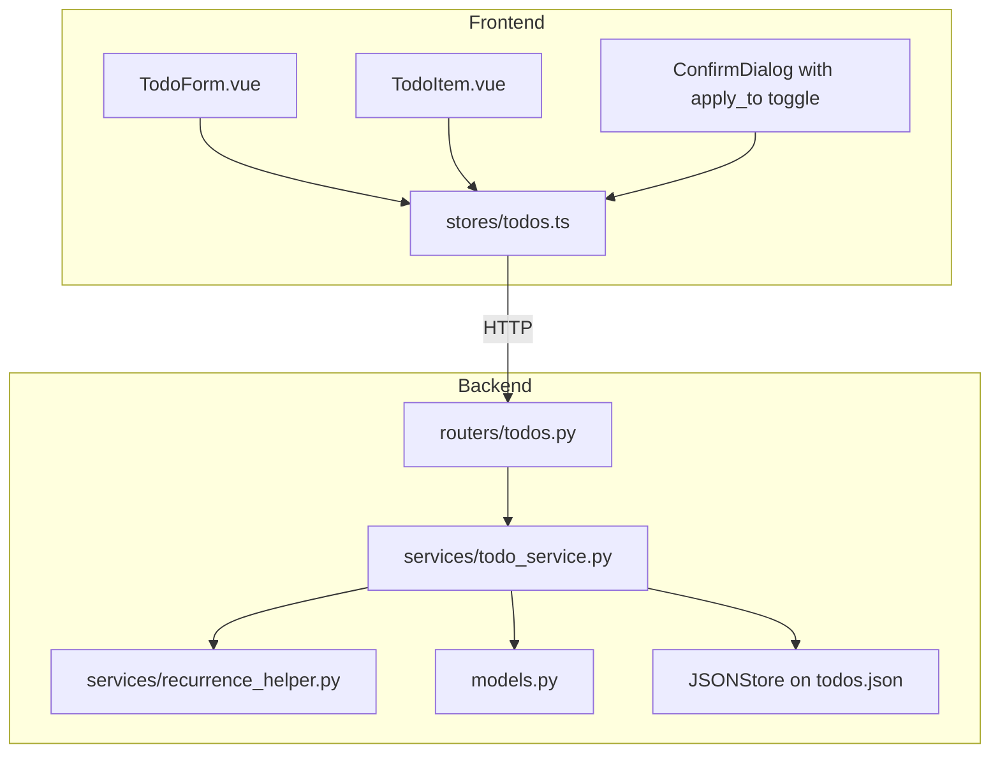
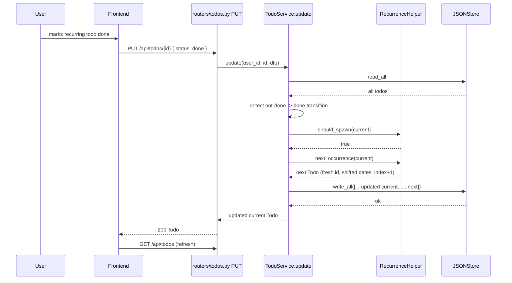
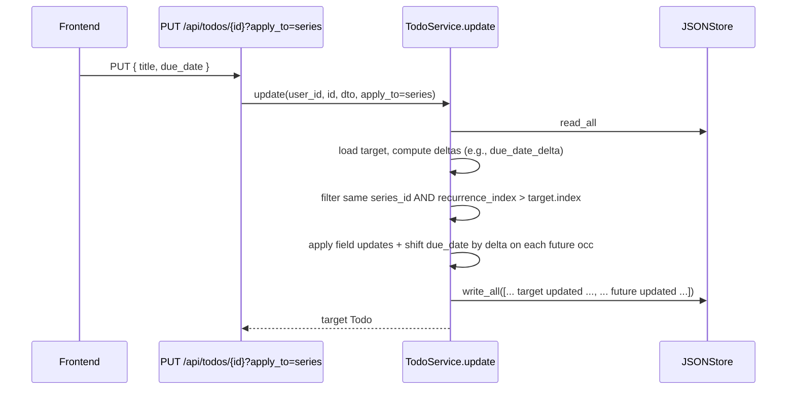

# Design Document: Recurring Todos

## Overview

This unit adds recurring todos. The Todo model gains a small group of recurrence fields; the `TodoService` gains a "spawn next occurrence" hook on the done-transition path; date arithmetic for daily/weekly/monthly/yearly cadences is encapsulated in a pure helper; and the frontend `TodoForm` gains a recurrence selector with end-condition controls plus an "Apply to: occurrence | series" toggle on edit and delete.

Key design decisions:

- **Spawn-on-done, not pre-generation.** We do not pre-create the entire series; only the next occurrence is materialized when the current one transitions to `done`. This keeps `todos.json` small, matches user mental models ("complete one to see the next"), and avoids dealing with edits to pre-generated future records.
- **Series id, not parent pointer.** Occurrences share `recurrence_series_id` rather than chaining via `previous_occurrence_id`. This makes "edit/delete future occurrences" a single filter (`series_id == X AND recurrence_index >= N`), and avoids a graph traversal.
- **DST-safe shift via `dateutil.relativedelta`.** Using `relativedelta(days=+1)` / `weeks=+1` / `months=+1` / `years=+1` correctly handles month-end clamping (Jan 31 → Feb 28) and DST transitions (preserves wall-clock time on `reminder_at`). Avoids hand-rolled arithmetic.
- **Idempotent done transition.** The spawn hook fires only on a transition (not-done → done). Re-saving a done todo, or toggling done off and back on, does not produce additional occurrences.
- **Atomic two-record write.** Marking the current occurrence done and creating the next occurrence are persisted in one `JSONStore.write_all` call to satisfy Requirement 11.4.
- **Series cap is checked before spawn.** If the next occurrence would exceed `recurrence_until` or `recurrence_count`, the current occurrence still completes; the spawn is simply skipped.

## Architecture



### Done-transition spawn flow



### Series edit (`apply_to=series`)



## Components and Interfaces

### Backend

#### 1. `models.py` additions

```python
from enum import Enum

class Recurrence(str, Enum):
    NONE = "none"
    DAILY = "daily"
    WEEKLY = "weekly"
    MONTHLY = "monthly"
    YEARLY = "yearly"

# Todo gains:
class Todo(BaseModel):
    # ... existing fields ...
    recurrence: Recurrence = Recurrence.NONE
    recurrence_until: str | None = None        # YYYY-MM-DD
    recurrence_count: int | None = Field(default=None, ge=1, le=1000)
    recurrence_series_id: str | None = None
    recurrence_index: int = 0

class TodoCreate(BaseModel):
    # ... existing fields ...
    recurrence: Recurrence = Recurrence.NONE
    recurrence_until: str | None = None
    recurrence_count: int | None = Field(default=None, ge=1, le=1000)

class TodoUpdate(BaseModel):
    # ... existing fields ...
    recurrence: Recurrence | None = None
    recurrence_until: str | None = None
    recurrence_count: int | None = None
```

Cross-field validation lives in `TodoService` (and a `model_validator` on `TodoCreate`/`TodoUpdate` for the simple cases) per Requirement 2.

#### 2. `services/recurrence_helper.py`

Pure module, no I/O.

```python
from datetime import date, datetime, timedelta
from dateutil.relativedelta import relativedelta
from .models import Todo, Recurrence

def shift_date(d: date, recurrence: Recurrence) -> date:
    """Return d shifted by exactly one cadence interval.
    Month/year shifts clamp to the last valid day if the original day doesn't exist."""
    if recurrence == Recurrence.DAILY:
        return d + relativedelta(days=+1)
    if recurrence == Recurrence.WEEKLY:
        return d + relativedelta(weeks=+1)
    if recurrence == Recurrence.MONTHLY:
        return d + relativedelta(months=+1)
    if recurrence == Recurrence.YEARLY:
        return d + relativedelta(years=+1)
    raise ValueError(f"Cannot shift for recurrence={recurrence}")

def shift_datetime(dt: datetime, recurrence: Recurrence) -> datetime:
    """Same as shift_date but preserves wall-clock time. DST-safe via relativedelta."""
    return dt + _delta_for(recurrence)

def should_spawn_next(current: Todo) -> bool:
    """True if the next occurrence is within series caps."""
    if current.recurrence == Recurrence.NONE:
        return False
    if current.due_date is None:
        return False
    next_index = current.recurrence_index + 1
    if current.recurrence_count is not None and next_index >= current.recurrence_count:
        return False
    next_due = shift_date(date.fromisoformat(current.due_date), current.recurrence)
    if current.recurrence_until is not None:
        until = date.fromisoformat(current.recurrence_until)
        if next_due > until:
            return False
    return True

def build_next_occurrence(current: Todo, now: datetime) -> Todo:
    """Construct the next occurrence Todo. Preconditions: should_spawn_next(current) is True."""
    next_due = shift_date(date.fromisoformat(current.due_date), current.recurrence).isoformat()
    next_reminder = (
        shift_datetime(current.reminder_at, current.recurrence)
        if current.reminder_at is not None
        else None
    )
    next_subtasks = [
        Subtask(id=str(uuid4()), title=s.title, done=False)
        for s in (current.subtasks or [])
    ]
    return Todo(
        id=str(uuid4()),
        user_id=current.user_id,
        title=current.title,
        description=current.description,
        priority=current.priority,
        due_date=next_due,
        reminder_at=next_reminder,
        status=Status.PENDING,
        folder_id=current.folder_id,
        tags=list(current.tags or []),
        subtasks=next_subtasks,
        image_url=None,                 # not propagated
        position=current.position,
        time_spent_seconds=0,
        recurrence=current.recurrence,
        recurrence_until=current.recurrence_until,
        recurrence_count=current.recurrence_count,
        recurrence_series_id=current.recurrence_series_id,
        recurrence_index=current.recurrence_index + 1,
        created_at=now,
        updated_at=None,
    )
```

#### 3. `services/todo_service.py` modifications

```python
class TodoService:
    # ... existing methods ...

    def create(self, user_id: str, data: TodoCreate) -> Todo:
        """
        Existing behavior plus:
        - Validate recurrence fields (Requirement 2).
        - If recurrence != none: assign recurrence_series_id, recurrence_index = 0.
        - If created already with status == done and recurrence != none: spawn next occurrence
          inside the same atomic write.
        """

    def update(
        self,
        user_id: str,
        todo_id: str,
        data: TodoUpdate,
        apply_to: Literal["occurrence", "series"] = "occurrence",
    ) -> Todo:
        """
        Existing behavior plus:
        - Validate recurrence fields (Requirement 2).
        - Detect transition not-done -> done; if applicable, spawn next occurrence atomically.
        - If apply_to == "series" and target has recurrence != none: apply field updates
          to all occurrences with same series_id and recurrence_index > target.index,
          shifting due_date / reminder_at by the delta computed on the target (Requirement 7.2).
        """

    def delete(
        self,
        user_id: str,
        todo_id: str,
        apply_to: Literal["occurrence", "series"] = "occurrence",
    ) -> None:
        """
        - apply_to == "occurrence": existing behavior.
        - apply_to == "series": delete target plus all occurrences with same series_id
          and recurrence_index >= target.index.
        """

    def list_todos(
        self,
        user_id: str,
        status: str | None,
        priority: str | None,
        sort_by: str | None,
        recurrence: str | None = None,   # new query param
    ) -> list[Todo]:
        """Existing behavior plus optional recurrence filter."""
```

Validation rules (private helper used by both `create` and `update`):

```python
def _validate_recurrence_fields(self, dto, target_due_date: str | None) -> None:
    if dto.recurrence in (None, Recurrence.NONE):
        # Allow update to clear; no other constraints apply when setting to none
        return
    if target_due_date is None:
        raise ValidationError("Recurring todos require due_date")
    if dto.recurrence_until and dto.recurrence_count:
        raise ValidationError("Set only one of recurrence_until or recurrence_count")
    if dto.recurrence_until:
        until = date.fromisoformat(dto.recurrence_until)  # raises if invalid
        if until <= date.fromisoformat(target_due_date):
            raise ValidationError("recurrence_until must be after due_date")
    if dto.recurrence_count is not None and (dto.recurrence_count < 1 or dto.recurrence_count > 1000):
        raise ValidationError("recurrence_count must be between 1 and 1000")
```

Done-transition detection:

```python
prior_status = stored_todo.status
new_status = dto.status if dto.status is not None else prior_status
is_done_transition = (prior_status != Status.DONE) and (new_status == Status.DONE)
```

#### 4. `routers/todos.py` changes

- `PUT /api/todos/{id}` accepts query parameter `apply_to`; passes through to service.
- `DELETE /api/todos/{id}` accepts query parameter `apply_to`; passes through.
- `GET /api/todos` accepts query parameter `recurrence`; passes through.

`apply_to` is constrained via `Query(..., regex="^(occurrence|series)$")`; invalid values return 422 (Requirements 7.3, 8.3).

### Frontend

#### 1. `types/index.ts` additions

```typescript
type Recurrence = 'none' | 'daily' | 'weekly' | 'monthly' | 'yearly'

interface Todo {
  // ...
  recurrence: Recurrence
  recurrence_until: string | null
  recurrence_count: number | null
  recurrence_series_id: string | null
  recurrence_index: number
}
```

#### 2. `components/TodoForm.vue` updates

- Recurrence dropdown with five options.
- Conditional "Ends on" date picker and "After N occurrences" numeric input, mutually exclusive (selecting one disables the other).
- Required-`due_date` enforcement when recurrence != none, with inline error.

#### 3. `components/TodoItem.vue` updates

- Recurrence badge (circular-arrow icon + label) shown when `recurrence != 'none'`.
- Hover tooltip: "Repeats {recurrence}" or "Repeats {recurrence}, ends {recurrence_until}" or "Repeats {recurrence}, {recurrence_index + 1} of {recurrence_count}".

#### 4. Edit and delete confirmation flow

- `components/RecurrenceApplyToToggle.vue`: radio with "This occurrence" (default) and "This and future occurrences".
- `TodoItem` edit button: when the todo is recurring, the existing edit modal includes the toggle at the bottom; the save button reads its value and passes `?apply_to=...` to the PUT call.
- `TodoItem` delete button: `ConfirmDialog` includes the same toggle when the todo is recurring; the confirm button reads it and passes `?apply_to=...` to DELETE.

#### 5. `stores/todos.ts` updates

- `updateTodo(id, dto, applyTo?: 'occurrence' | 'series')` and `deleteTodo(id, applyTo?: 'occurrence' | 'series')` signatures extended.
- Optimistic update logic: when `apply_to=series`, the optimistic patch needs to be applied to all in-store todos with matching series id. On failure, full refetch from server.
- After done-transition on a recurring todo, store calls `fetchTodos()` to pick up the spawned next occurrence (Requirement 10.7).

## Data Models

### `todos.json` shape (new fields highlighted)

```json
{
  "id": "todo-uuid",
  "user_id": "user-uuid",
  "title": "Pay rent",
  "due_date": "2026-06-01",
  "reminder_at": "2026-05-30T09:00:00Z",
  "status": "pending",
  "priority": "high",
  "recurrence": "monthly",
  "recurrence_until": null,
  "recurrence_count": 12,
  "recurrence_series_id": "series-uuid",
  "recurrence_index": 0,
  "subtasks": [],
  "comments": [],
  "created_at": "2026-05-24T11:00:00Z",
  "updated_at": null
}
```

## Correctness Properties

### Property 1: Recurrence input validation rejection

*For any* create or update request with: invalid `recurrence`, recurrence != none and missing due_date, both `recurrence_until` and `recurrence_count` set, invalid `recurrence_until` format, `recurrence_until <= due_date`, or `recurrence_count` outside [1, 1000], the Todo_Service SHALL return a 422 validation error and SHALL NOT modify the store.

**Validates: Requirements 2.1, 2.2, 2.3, 2.4, 2.5**

### Property 2: Series id lifecycle

*For any* sequence of create + update operations, every Todo with `recurrence != none` SHALL have a non-null `recurrence_series_id`, and every Todo with `recurrence == none` SHALL have `recurrence_series_id == null`. When `recurrence` transitions from `none` to non-`none`, a fresh UUID4 SHALL be assigned. When transitioning from non-`none` to `none`, `recurrence_series_id`, `recurrence_until`, and `recurrence_count` SHALL be cleared on the affected Todo only.

**Validates: Requirements 3.1, 3.2, 3.3, 3.4, 2.6**

### Property 3: Spawn on done-transition is exactly-once

*For any* recurring Todo that has not yet spawned its next occurrence, performing N updates with `status == done` (where the first such update is a not-done -> done transition) SHALL result in exactly one new Todo being added to the store with `recurrence_index = current.recurrence_index + 1`.

**Validates: Requirements 4.1, 6.2**

### Property 4: No spawn for non-recurring or capped series

*For any* Todo with `recurrence == none` transitioning to done, no new Todo SHALL be added to the store. *For any* Todo with `recurrence != none` whose next-occurrence due_date would exceed `recurrence_until`, OR whose `recurrence_index + 1 >= recurrence_count`, no new Todo SHALL be added; the current Todo SHALL still be marked done.

**Validates: Requirements 5.1, 5.2, 5.3, 5.4, 6.3**

### Property 5: Date shift correctness

*For any* date d and recurrence r in {daily, weekly, monthly, yearly}, `shift_date(d, r)` SHALL equal d shifted by the corresponding `relativedelta`, with month/year shifts clamping to the last valid day when the source day-of-month does not exist in the target month (Jan 31 + 1 month = Feb 28 in non-leap years; Feb 29 + 1 year = Feb 28 in non-leap years).

**Validates: Requirements 4.4**

### Property 6: Reminder shift preserves wall-clock time

*For any* datetime dt and recurrence r, `shift_datetime(dt, r)` SHALL equal dt shifted by the same calendar interval used for the date, preserving the wall-clock hour/minute/second of `dt`. (Asserted by inspecting the result against `dt + relativedelta(...)` rather than fixed seconds.)

**Validates: Requirements 4.5**

### Property 7: Next occurrence inherits template fields

*For any* spawned next occurrence N derived from completed C, the following fields SHALL satisfy: `N.user_id == C.user_id`; `N.title == C.title`; `N.description == C.description`; `N.priority == C.priority`; `N.folder_id == C.folder_id`; `N.tags == C.tags`; `N.recurrence == C.recurrence`; `N.recurrence_until == C.recurrence_until`; `N.recurrence_count == C.recurrence_count`; `N.recurrence_series_id == C.recurrence_series_id`; `N.position == C.position`; `N.recurrence_index == C.recurrence_index + 1`; `N.status == pending`; `N.comments == []`; every subtask in `N.subtasks` has `done == false`.

**Validates: Requirements 4.1, 4.2, 4.3, 4.6, 4.7**

### Property 8: User isolation extends to series

*For any* user A who is not the owner of a series S, no `update` or `delete` call by A SHALL modify any occurrence in S, regardless of the `apply_to` value, and no `list_todos` call by A SHALL return any occurrence in S.

**Validates: Requirements 11.3**

### Property 9: Series edit preserves per-occurrence identity

*For any* `update(..., apply_to="series")` call, every occurrence in the affected set (target plus future occurrences) SHALL retain its original `id`, `created_at`, `recurrence_index`, `recurrence_series_id`, and `position`. Date-bearing fields shifted by the delta computed on the target SHALL maintain their relative ordering.

**Validates: Requirements 7.2**

### Property 10: Series delete affects only target and future

*For any* `delete(..., apply_to="series")` call, after the call: every occurrence in the same series with `recurrence_index < target.recurrence_index` SHALL still exist; no occurrence in the same series with `recurrence_index >= target.recurrence_index` SHALL exist.

**Validates: Requirements 8.2**

### Property 11: Atomic done + spawn

*For any* update that transitions a recurring Todo to done and spawns a next occurrence, both writes SHALL appear in `todos.json` together or `todos.json` SHALL remain in its prior valid state. (Reuses Property 18 of `fullstack-todo-app`.)

**Validates: Requirements 11.4**

### Property 12: Recurrence round-trip

*For any* valid Todo with non-default recurrence fields, serializing to JSON and deserializing back SHALL produce an equivalent Todo with the same recurrence values.

**Validates: Requirements 11.2**

### Property 13: Backward-compatible read

*For any* Todo record stored in `todos.json` lacking some or all of the recurrence fields, reading it SHALL produce a Todo with the corresponding default values (`recurrence == none`, `recurrence_until == null`, `recurrence_count == null`, `recurrence_series_id == null`, `recurrence_index == 0`) and SHALL NOT raise a validation error.

**Validates: Requirements 1.6**

## Error Handling

| Error | Status | Where | Message |
|-------|--------|-------|---------|
| Invalid recurrence enum | 422 | TodoService | `[{"field":"recurrence","message":"Invalid recurrence"}]` |
| recurrence != none with no due_date | 422 | TodoService | `[{"field":"recurrence","message":"Recurring todos require due_date"}]` |
| Both bounds set | 422 | TodoService | `[{"field":"recurrence_until","message":"Set only one of recurrence_until or recurrence_count"}]` |
| recurrence_until <= due_date | 422 | TodoService | `[{"field":"recurrence_until","message":"Must be after due_date"}]` |
| recurrence_count out of range | 422 | TodoService | `[{"field":"recurrence_count","message":"Must be between 1 and 1000"}]` |
| Invalid apply_to value | 422 | router | `[{"field":"apply_to","message":"Must be 'occurrence' or 'series'"}]` |

Frontend reuses the existing toast + field-error patterns.

## Testing Strategy

### Backend

**Unit / example-based**:
- `recurrence_helper.shift_date`: matrix of edge dates (Jan 31 monthly, Feb 29 yearly, DST boundaries Mar/Nov in America/New_York if reminder_at uses tz-aware datetimes).
- `should_spawn_next`: combinations of `recurrence_until` and `recurrence_count` exhaustively at the boundary.
- `TodoService.update`: done-transition spawn path; no-spawn paths (already done, recurrence==none, capped series); apply_to=series propagation; apply_to=occurrence isolation.
- `TodoService.delete` apply_to=series.
- Backward-read: a `todos.json` containing legacy Todo records (no recurrence fields) is read without error and updated cleanly.

**Property-based** (Hypothesis, `@settings(max_examples=100)`):
- Properties 1-13 above. Each tagged `Feature: recurring-todos, Property {N}: {title}`.

**Strategies**:
```python
recurrence_strategy()        # Recurrence enum
valid_due_date()             # 1990-01-01..2050-12-31
recurrence_until_after(due)  # date > due, capped at +10 years
recurrence_count_strategy()  # ints in [1, 1000]
recurring_todo()             # Todo with recurrence != none and consistent caps
done_transition_dto()        # TodoUpdate fixing status to done
```

### Frontend

- `TodoForm.vue`: recurrence selector toggles end-condition fields; `due_date` required when recurrence != none.
- `TodoItem.vue`: recurrence badge appears for recurrence != none; tooltip text matches.
- Edit/delete `apply_to` toggle: emits the chosen value; default is `occurrence`.
- Store after done-transition: refetches todo list.

### Test layout additions

```
backend/tests/
  test_recurrence_helper.py
  test_todo_service_recurrence.py
  test_todo_router_recurrence.py

frontend/tests/components/
  TodoForm.recurrence.spec.ts
  TodoItem.recurrence.spec.ts
```
