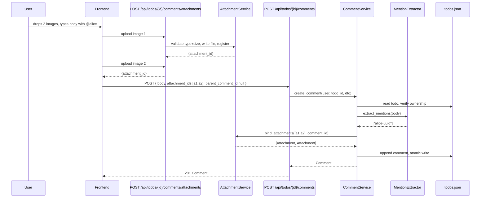

# Design Document: Todo Comments (Threads + Mentions + Attachments)

## Overview

This unit adds threaded comments to todos. Comments live inline on their parent Todo (within `todos.json`), are authored by users, can reply to each other up to 5 levels deep, can mention other users with `@username`, and can include up to 4 image attachments per comment. Attachments are stored as files under `/backend/data/uploads/comments/`.

The design extends the existing `fullstack-todo-app` architecture without changing its core layering (Routers → Services → Models → Store). It introduces:

- A `CommentService` that owns all comment operations and shares the existing `JSONStore` for todos.
- A new attachments router and a new uploads directory.
- An `Attachment` registry (a third JSON file: `attachments.json`) for tracking pre-uploaded attachments before they are bound to a comment.
- A small mention-extraction module shared by create and edit paths.
- Frontend additions: a `CommentThread.vue` component tree, a `CommentInput.vue` with mention autocomplete, and a `useComments` Pinia store slice.

Key design decisions and tradeoffs:

- **Inline storage** (`comments` array on each Todo) over a separate `comments.json`: simpler atomic writes, no cross-file consistency, but requires rewriting the whole Todo on every comment change. Acceptable for a JSON-store demo; revisited in the SQLite migration spec.
- **Soft delete via tombstone** when a comment has replies: preserves thread structure without exposing `[deleted]` text in `body` to mention extraction (the extractor reads `body` exactly as stored, so tombstones produce no mentions).
- **Two-step attachment upload**: the client uploads each file first to get an `attachment_id`, then submits the comment referencing those ids. This avoids buffering large multipart bodies through the comment-create endpoint and lets the user remove an upload before submit.
- **Attachment registry** tracks `(id, owner_user_id, file_path, used_by_comment_id?)`. A periodic cleanup deletes orphaned attachments older than 1 hour. Without this, an unsubmitted upload would leak.
- **Mention regex avoids code spans** so `` `@channel` `` in a code-formatted body does not produce a mention. This is the only piece of body parsing we do; everything else is rendered client-side.

## Architecture

```mermaid
graph TB
    subgraph Frontend["Frontend (Nuxt 3)"]
        Modal[TodoEditModal]
        Thread[CommentThread.vue]
        Input[CommentInput.vue]
        Mention[MentionAutocomplete.vue]
        Store[stores/comments.ts]
        Comp[composables/useComments.ts]
    end

    subgraph Backend["Backend (FastAPI)"]
        CR[routers/comments.py]
        AR[routers/attachments.py]
        CS[services/comment_service.py]
        AS[services/attachment_service.py]
        ME[services/mention_extractor.py]
        Static[StaticFiles /uploads]
    end

    subgraph Store["JSON Store"]
        Todos[todos.json]
        Atts[attachments.json]
        Files[/backend/data/uploads/comments/*.png|jpg|gif|webp]
    end

    Modal --> Thread
    Thread --> Input
    Input --> Mention
    Modal --> Store
    Store --> Comp
    Comp -->|HTTP+Cookies| CR
    Comp -->|HTTP+Cookies| AR
    CR --> CS
    AR --> AS
    CS --> ME
    CS --> Todos
    AS --> Atts
    AS --> Files
    Static --> Files
```

### Comment-create flow



## Components and Interfaces

### Backend

#### 1. `models.py` additions

```python
from pydantic import BaseModel, Field
from datetime import datetime

class Attachment(BaseModel):
    id: str                           # UUID4
    url: str                          # /uploads/comments/<uuid>.<ext>
    filename: str                     # sanitized original name
    mime_type: str                    # one of ALLOWED_ATTACHMENT_MIME_TYPES
    size_bytes: int

class Comment(BaseModel):
    id: str
    todo_id: str
    author_id: str
    body: str = Field(min_length=1, max_length=2000)
    parent_comment_id: str | None = None
    mentions: list[str] = Field(default_factory=list)
    attachments: list[Attachment] = Field(default_factory=list)
    is_tombstone: bool = False
    created_at: datetime
    updated_at: datetime | None = None

# Todo gains:
class Todo(BaseModel):
    # ... existing fields ...
    comments: list[Comment] = Field(default_factory=list)

# Request DTOs
class CommentCreate(BaseModel):
    body: str = Field(min_length=1, max_length=2000)
    parent_comment_id: str | None = None
    attachment_ids: list[str] = Field(default_factory=list, max_length=4)

class CommentUpdate(BaseModel):
    body: str | None = Field(default=None, min_length=1, max_length=2000)
    attachment_ids: list[str] | None = Field(default=None, max_length=4)

# Response DTOs (denormalized mentions for the frontend)
class MentionRef(BaseModel):
    id: str
    username: str

class CommentResponse(BaseModel):
    id: str
    todo_id: str
    author_id: str
    author_username: str
    body: str
    parent_comment_id: str | None
    mentions: list[MentionRef]
    attachments: list[Attachment]
    is_tombstone: bool
    created_at: datetime
    updated_at: datetime | None
```

#### 2. `services/mention_extractor.py`

Pure module, no I/O. Imported by `CommentService`.

```python
import re

# Match @username outside of backtick code spans.
# Pre-pass: strip code spans, then run a simple regex.
_MENTION_RE = re.compile(r"(?<![A-Za-z0-9_])@([A-Za-z0-9_]{3,30})(?![A-Za-z0-9_])")
_CODE_SPAN_RE = re.compile(r"`[^`]*`")

def extract_mention_usernames(body: str) -> list[str]:
    """Return deduplicated usernames in document order, ignoring code spans."""
    cleaned = _CODE_SPAN_RE.sub(lambda _: "", body)
    seen, out = set(), []
    for m in _MENTION_RE.finditer(cleaned):
        u = m.group(1)
        if u not in seen:
            seen.add(u)
            out.append(u)
    return out
```

#### 3. `services/attachment_service.py`

```python
class AttachmentService:
    def __init__(self, attachment_store: JSONStore, uploads_dir: Path):
        ...

    def upload(self, owner_user_id: str, file: UploadFile) -> Attachment:
        """Validate type+size, write to disk with UUID filename, register in attachments.json
        with used_by_comment_id=None. Raises ValidationError or PayloadTooLargeError."""

    def bind_to_comment(self, owner_user_id: str, attachment_ids: list[str], comment_id: str) -> list[Attachment]:
        """Mark attachments as owned by a comment. Each id must exist, be owned by owner_user_id,
        and currently unbound or already bound to comment_id (idempotent on edits).
        Raises ValidationError on any mismatch."""

    def unbind_from_comment(self, comment_id: str) -> None:
        """On comment delete: clear used_by_comment_id; deletion of files happens in cleanup."""

    def delete_unreferenced(self, attachment_ids: list[str]) -> None:
        """Delete files and registry entries for attachments not referenced by any comment.
        Used after comment delete (Requirement 5.8)."""

    def sweep_orphans(self, max_age_seconds: int = 3600) -> int:
        """Delete unbound attachments older than max_age_seconds. Returns count deleted.
        Called from a startup background task on a 10-minute interval."""
```

Validation constants live in `attachment_service.py`:

```python
ALLOWED_MIME_TYPES = {"image/png", "image/jpeg", "image/gif", "image/webp"}
ALLOWED_EXTENSIONS = {".png", ".jpg", ".jpeg", ".gif", ".webp"}
MAX_BYTES = 5 * 1024 * 1024   # 5 MB
MAX_PER_COMMENT = 4
```

#### 4. `services/comment_service.py`

```python
class CommentService:
    MAX_THREAD_DEPTH = 5

    def __init__(self, todo_store: JSONStore, user_store: JSONStore, attachment_service: AttachmentService):
        ...

    def list_comments(self, user_id: str, todo_id: str) -> list[CommentResponse]:
        """Return all comments on the user's todo, ordered by created_at asc.
        Resolves mentions to MentionRef for the response."""

    def create_comment(self, user_id: str, todo_id: str, data: CommentCreate) -> CommentResponse:
        """Validate todo ownership, validate parent (if any), check thread depth,
        extract+resolve mentions, bind attachments, append comment, atomic write."""

    def update_comment(self, user_id: str, todo_id: str, comment_id: str, data: CommentUpdate) -> CommentResponse:
        """Author-only edit. Re-resolves mentions, re-binds attachments, sets updated_at."""

    def delete_comment(self, user_id: str, todo_id: str, comment_id: str) -> None:
        """Author-only delete. Tombstones if it has replies; otherwise removes record
        and triggers attachment cleanup."""

    # internals
    def _depth(self, todo: Todo, parent_id: str) -> int:
        """Count from a parent up to root, with cycle detection (visited set)."""

    def _resolve_mentions(self, usernames: list[str]) -> list[MentionRef]:
        """Look up users by username via user_store; skip unknown names."""
```

#### 5. Routers

`backend/routers/attachments.py`

```
POST   /api/comment-attachments        multipart upload      -> 201 Attachment
DELETE /api/comment-attachments/{id}   delete unbound only   -> 204
```

`backend/routers/comments.py` (mounted under existing todos router)

```
GET    /api/todos/{id}/comments                              -> 200 list[CommentResponse]
POST   /api/todos/{id}/comments                              -> 201 CommentResponse
PUT    /api/todos/{id}/comments/{cid}                        -> 200 CommentResponse
DELETE /api/todos/{id}/comments/{cid}                        -> 204
```

All endpoints depend on `get_current_user`. Static file serving for `/uploads/comments/*` is configured in `main.py` via `app.mount("/uploads", StaticFiles(directory="data/uploads"))`.

#### 6. Background sweep

In `main.py` startup:

```python
@app.on_event("startup")
async def schedule_attachment_sweep():
    async def loop():
        while True:
            await asyncio.sleep(600)
            attachment_service.sweep_orphans()
    asyncio.create_task(loop())
```

### Frontend

#### 1. `types/index.ts` additions

```typescript
interface Attachment {
  id: string
  url: string
  filename: string
  mime_type: string
  size_bytes: number
}

interface MentionRef {
  id: string
  username: string
}

interface Comment {
  id: string
  todo_id: string
  author_id: string
  author_username: string
  body: string
  parent_comment_id: string | null
  mentions: MentionRef[]
  attachments: Attachment[]
  is_tombstone: boolean
  created_at: string
  updated_at: string | null
}
```

#### 2. `stores/comments.ts` (Pinia)

```typescript
state: () => ({
  byTodoId: {} as Record<string, Comment[]>,
  loading: {} as Record<string, boolean>,
  error: {} as Record<string, string | null>,
})

actions: {
  async fetch(todoId: string)            // GET
  async create(todoId, dto)              // POST, optimistic insert
  async update(todoId, commentId, dto)   // PUT, optimistic patch
  async remove(todoId, commentId)        // DELETE, optimistic remove or tombstone
}
```

#### 3. Components

- `components/comments/CommentThread.vue`: Recursive component. Takes `commentId | null` (null = top-level) and renders children where `parent_comment_id === commentId`. Self-recurses for nested replies. Stops recursing past `MAX_THREAD_DEPTH`.
- `components/comments/CommentItem.vue`: Renders one comment (avatar placeholder, username, relative time, body with mentions/attachments rendered, action buttons).
- `components/comments/CommentInput.vue`: Textarea with attached file list, mention autocomplete trigger, submit button. Emits `submit({ body, parent_comment_id, attachment_ids })`.
- `components/comments/MentionAutocomplete.vue`: Floating list of usernames matching current `@`-prefix. Hits an existing `GET /api/users/search?q=` endpoint (added with this spec) that returns `[{id, username}]`, capped at 8 results, only matching `username` prefix.
- `components/comments/AttachmentPreview.vue`: Thumbnail with remove button. Used both during composition and inside rendered comments.
- Modifications to `components/TodoForm.vue` (or the edit modal): mount `<CommentThread :todoId="todo.id" :parentCommentId="null" />` in a "Comments" section visible only when editing an existing todo (not on create).

#### 4. New endpoint: `GET /api/users/search?q=`

Required for mention autocomplete. Lives in `backend/routers/users.py` (new file).

```
GET /api/users/search?q=<prefix>     -> 200 list[MentionRef] (max 8)
```

Authenticated. Matches by username case-insensitively, prefix-only. Returns at most 8.

Reasoning: the alternative (resolving mentions client-side from a full user list) leaks all usernames. A server-side prefix search is small and safe.

## Data Models

### `attachments.json` schema

```json
[
  {
    "id": "uuid",
    "owner_user_id": "uuid",
    "file_path": "data/uploads/comments/<uuid>.png",
    "url": "/uploads/comments/<uuid>.png",
    "filename": "screenshot.png",
    "mime_type": "image/png",
    "size_bytes": 12345,
    "used_by_comment_id": "uuid|null",
    "created_at": "2026-05-24T10:55:00Z"
  }
]
```

### Inline `comments` on Todo (in `todos.json`)

```json
{
  "id": "todo-uuid",
  "user_id": "user-uuid",
  "title": "...",
  "comments": [
    {
      "id": "c1",
      "todo_id": "todo-uuid",
      "author_id": "user-uuid",
      "body": "Discussed with @bob, see screenshot",
      "parent_comment_id": null,
      "mentions": ["bob-user-uuid"],
      "attachments": [{"id": "a1", "url": "/uploads/comments/abc.png", "filename": "screenshot.png", "mime_type": "image/png", "size_bytes": 12345}],
      "is_tombstone": false,
      "created_at": "2026-05-24T10:55:00Z",
      "updated_at": null
    },
    {
      "id": "c2",
      "todo_id": "todo-uuid",
      "author_id": "user-uuid",
      "body": "Resolved.",
      "parent_comment_id": "c1",
      "mentions": [],
      "attachments": [],
      "is_tombstone": false,
      "created_at": "2026-05-24T11:02:00Z",
      "updated_at": null
    }
  ]
}
```

## Correctness Properties

These are universal properties enforceable by Hypothesis-based tests.

### Property 1: Comment ownership isolation

*For any* user A who is not the owner of todo T, all CommentService operations targeting T (`list`, `create`, `update`, `delete`) SHALL return a 404 not found error and SHALL NOT modify the store.

**Validates: Requirements 2.3, 6.2, 7.4, 8.2, 10.4**

### Property 2: Author-only edit/delete

*For any* user A who is not the author of comment C, calls to `update_comment` and `delete_comment` for C SHALL return 404 and SHALL NOT modify the store.

**Validates: Requirements 6.2, 7.4**

### Property 3: Thread depth bound

*For any* sequence of comment creations on a todo, no comment SHALL have a depth greater than `MAX_THREAD_DEPTH` (=5). A creation that would exceed the bound SHALL fail with 422 and SHALL NOT modify the store.

**Validates: Requirements 3.3**

### Property 4: Cycle-free parent chain

*For any* comment C, traversing `parent_comment_id` from C SHALL terminate at a top-level comment (parent_comment_id == null) within at most `MAX_THREAD_DEPTH` steps. There SHALL NOT exist a cycle.

**Validates: Requirements 3.4, 10.2** (relies on the fact that `parent_comment_id` is set at create time and never modified, plus depth check)

### Property 5: Mention extraction is body-text-only

*For any* comment C, the resolved `mentions` array SHALL be a subset of the user ids whose usernames appear as `@<username>` tokens in `C.body` (per the mention regex applied after code-span stripping). No id outside this set SHALL appear in `mentions`.

**Validates: Requirements 4.1, 4.2, 4.4**

### Property 6: Mention dedup and order preservation

*For any* body B, `extract_mention_usernames(B)` SHALL return a list with no duplicates, and the order SHALL match the first-appearance order of each `@username` in B.

**Validates: Requirements 4.2**

### Property 7: Code-span exclusion

*For any* body B containing a `@username` token only inside backtick-delimited code spans (e.g., `` `@bob` ``), `extract_mention_usernames(B)` SHALL NOT include that username.

**Validates: Requirements 4.1**

### Property 8: Attachment count bound

*For any* comment create or update where `attachment_ids` has more than `MAX_ATTACHMENTS_PER_COMMENT` (=4) entries, the operation SHALL fail with 422 and SHALL NOT modify the store.

**Validates: Requirements 5.7**

### Property 9: Attachment ownership

*For any* `bind_to_comment` call, every attachment id in the input SHALL be owned by the requesting user. If any id is owned by a different user, the operation SHALL fail with 422 and SHALL NOT bind any attachments.

**Validates: Requirements 5.6**

### Property 10: Attachment type/size enforcement

*For any* upload, if MIME type is not in `ALLOWED_MIME_TYPES` or size exceeds `MAX_BYTES`, the operation SHALL fail (422 or 413) and SHALL NOT write a file to disk nor register an attachment.

**Validates: Requirements 5.3, 5.4**

### Property 11: Tombstone preserves thread structure

*For any* comment C with replies that is deleted by its author, after deletion: C SHALL still exist with `is_tombstone == True` and `body == "[deleted]"`, and every reply that previously had `parent_comment_id == C.id` SHALL still reference C unchanged.

**Validates: Requirements 7.2**

### Property 12: Hard-delete removes record and unreferenced attachments

*For any* comment C without replies that is deleted by its author, after deletion: C SHALL no longer be in the parent Todo's `comments`, and any attachment whose `used_by_comment_id == C.id` and that is not referenced by any other comment SHALL have its file removed and its registry entry removed.

**Validates: Requirements 5.8, 7.3**

### Property 13: Comment round-trip

*For any* valid Comment object (including tombstones, with attachments and mentions), serializing the parent Todo to JSON and deserializing back SHALL produce a Todo whose `comments` array is element-wise equal to the original.

**Validates: Requirements 10.2**

### Property 14: Backward-compatible read

*For any* Todo record stored in `todos.json` without a `comments` key, reading the record through the Backend SHALL produce a Todo whose `comments == []` and SHALL NOT raise a validation error.

**Validates: Requirements 1.4**

### Property 15: Mention resolution is total over known users

*For any* body B and the current set of users U, `_resolve_mentions(extract_mention_usernames(B))` SHALL return exactly the MentionRefs whose username appears in B and is also in U. No user not in U SHALL appear; every user in U whose username appears (per Property 5) SHALL appear.

**Validates: Requirements 4.3**

## Error Handling

| Error | Status | Where | Message shape |
|-------|--------|-------|---------------|
| Todo not found / not owned | 404 | comments router | `{"detail": "Todo not found"}` |
| Comment not found / not owned | 404 | comments router | `{"detail": "Comment not found"}` |
| Body empty / missing / too long | 422 | CommentService | `{"detail": [{"field": "body", "message": "..."}]}` |
| Invalid parent_comment_id | 422 | CommentService | `{"detail": [{"field": "parent_comment_id", "message": "..."}]}` |
| Thread depth exceeded | 422 | CommentService | `{"detail": [{"field": "parent_comment_id", "message": "Max reply depth reached"}]}` |
| Cycle detected (defensive) | 500 | CommentService | `{"detail": "Internal server error"}` |
| Attachment unsupported type | 422 | AttachmentService | `{"detail": [{"field": "file", "message": "Unsupported file type"}]}` |
| Attachment too large | 413 | attachments router | `{"detail": "File too large"}` |
| Too many attachments | 422 | CommentService | `{"detail": [{"field": "attachment_ids", "message": "Maximum 4 attachments"}]}` |
| Attachment id invalid / not owned | 422 | AttachmentService | `{"detail": [{"field": "attachment_ids", "message": "Invalid attachment id"}]}` |

Frontend handling reuses the existing toast + field-error patterns. Optimistic create/edit/delete with rollback on failure (Requirement 9.7).

## Testing Strategy

### Backend

**Unit / example-based**:
- Mention extractor: matrix of bodies (plain, with code spans, edge whitespace, emoji adjacent, multiple mentions, repeated mentions).
- Attachment service: each rejection path (mime, size, ownership, double-bind).
- Comment service: parent validation, depth-1..5 chains, depth-6 rejection, tombstone vs hard-delete branches.
- Router integration: full happy-path create/edit/delete via TestClient with cookies.

**Property-based** (Hypothesis, `@settings(max_examples=100)`):
- Properties 1-15 above. Each tagged with `Feature: todo-comments, Property {N}: {title}`.

**Strategies**:
```python
mention_username() = text(alphabet="A-Za-z0-9_", min_size=3, max_size=30)
mention_body()     = builds a body with k random mentions and m random non-mention @-strings,
                     optionally wrapping any of them in backticks
plain_body()       = text(min_size=1, max_size=2000) filtered to non-whitespace-only
attachment_dto()   = builds an Attachment with random valid mime/size
todo_with_comments() = a Todo whose comments form a valid (acyclic, depth<=5) tree
```

### Frontend

- `CommentThread.vue` recursive rendering: depth=1, depth=5, mixed depth.
- `CommentInput.vue` mention autocomplete trigger (typing `@a` shows results, selecting inserts token).
- `useComments` optimistic flow: success keeps optimistic state, failure rolls back.
- Tombstone rendering: `is_tombstone` shows `[deleted]` styled and hides action buttons.

### Test layout additions

```
backend/tests/
  test_mention_extractor.py
  test_attachment_service.py
  test_comment_service.py
  test_comment_router.py
  test_attachment_router.py

frontend/tests/components/comments/
  CommentThread.spec.ts
  CommentInput.spec.ts
  CommentItem.spec.ts
```
